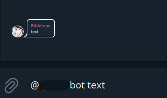

# Stickerizer

Simple Telegram bot for quote sticker generation

### Setup:

1. Create telegram bot and enable InlineMode
2. Set bot token as `TOKEN` environment variable
3. Start bot

### Usage:

Type `@YourBotName text` in any chat and bot will generate quote sticker with provided text in inline reply window

